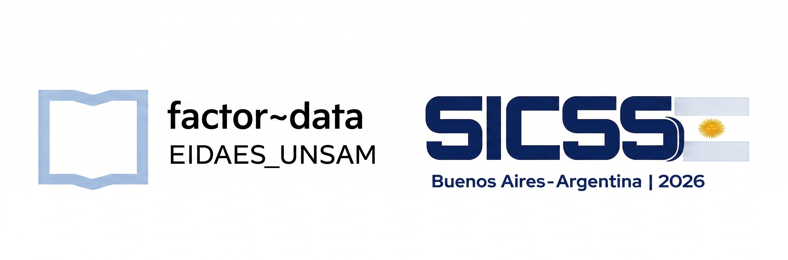

# Taller de Procesamiento de Lenguaje Natural

# Docentes
- [Germán Rosati](https://gefero.github.io/)
- [Juan Manuel Pérez](https://www.linkedin.com/in/perezjuanma/)
- [Tomás Maguire](https://www.linkedin.com/in/tomasebm/)

# Ayudante
- Román Fernández Arias

# Presentación
Este taller es una introducción práctica al **Procesamiento de Lenguaje Natural
(NLP)** para la investigación en ciencias sociales, dictado en el **Summer
Institute in Computational Social Sciences (SICSS) - Buenos Aires** por
**[Factor~Data](https://factor-data.netlify.app/)**.

Se propone que las y los asistentes:
- comprendan conceptos metodológicos fundamentales para el preprocesamiento de
  datos textuales (tokenización, lematización, stemming, etc.) y la
  representación vectorial clásica de textos (Document-Term Matrix, Bag of
  Words, etc.);
- se introduzcan a técnicas modernas de representación vectorial de textos
  (word embeddings, word2vec);
- incorporen nociones básicas de la arquitectura Transformer (mecanismo de
  atención, positional encoding, etc.);
- se familiaricen con conceptos centrales de prompting (roles, instrucciones)
  y con los riesgos y usos de los Large Language Models (LLMs).

El repositorio con todo el material (diapositivas, notebooks y datasets) está
disponible en [GitHub](https://github.com/gefero/factor_data_tuto_NLP_SICSS).

# Contenidos y materiales
## M0. Detectando tópicos en un corpus
Qué es NLP y el problema del dato no estructurado, un flujo de trabajo
"típico" en NLP (limpieza de texto, stopwords, tokenización, stemming vs.
lematización), representación matemática de un texto (Document-Term Matrix,
Bag of Words) y modelado de tópicos con Latent Dirichlet Allocation (LDA).
- [Diapositivas](https://docs.google.com/presentation/d/1ZoOBD8BvoVZkAu_58hRxQe2xowutgVfrsGJo3tR4QeY/edit?usp=sharing)
- [Notebook](https://drive.google.com/file/d/1CjMq7aKPH_P_mFDEtRlNgLUFpanNnzNQ/view?usp=sharing)

## M1. Acercamiento a los word embeddings
Semántica léxica y semántica vectorial, matrices de co-ocurrencia
palabra-contexto, similitud coseno, la intuición de word2vec (skip-gram,
negative sampling) y aplicaciones en ciencias sociales (detección de
estereotipos, trayectorias).
- [Diapositivas](https://docs.google.com/presentation/d/1AQ9mwtzUg23ePFU37xi0usMqIVRizvyefeBVp8fatEY/edit?usp=sharing)
- [Notebook](https://colab.research.google.com/drive/1UUr5TWTf1DR-U_QGNyFxaYhtA9Vj06WP?usp=sharing)

## M2. Transformers
De los modelos secuenciales (RNN) a los Transformers: embeddings de
entrada/salida, self-attention (Query/Key/Value), atención multicabezal y
positional encoding. Reseña de GPT y BERT.
- [Diapositivas](https://docs.google.com/presentation/d/1WW7WRTLpKdnNJDQY3j9FnNpOSMYSC27IQILWU98lOoA/edit?usp=sharing)
- [Notebook](https://colab.research.google.com/drive/1bTeXc6RHtIQaOcD0v1C5YTE2VKTQ-hlI?usp=sharing)

## M3. ¿Cómo interactuamos con un LLM?
Evolución de los LLMs, para qué (no) conviene usarlos, sus riesgos
(alucinaciones, sesgos) y transfer learning/fine-tuning. Guía práctica de
prompt engineering: roles (`system`/`user`), x-shot learning y Chain of
Thought (CoT).
- [Diapositivas](https://docs.google.com/presentation/d/1mtF_NDhC8dnK7CAWxcgTcdErfrcu2EPxe5JPe-L2yuE/edit?usp=sharing)
